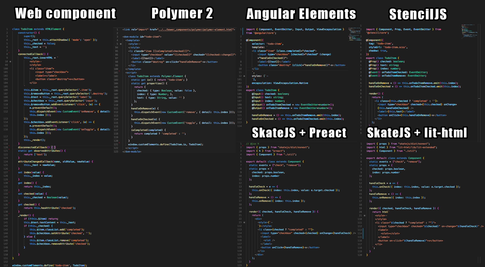
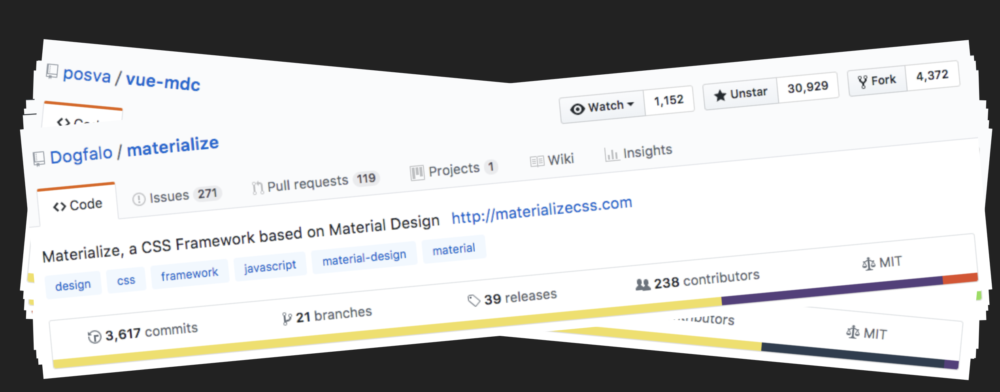
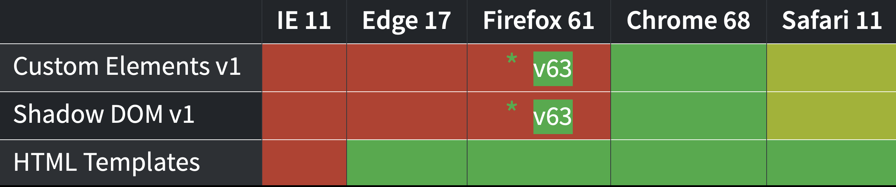
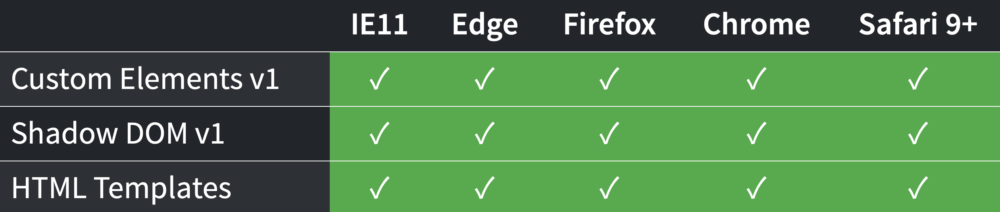

# 1-1 Sobre Stencil

Es un compilador para generar Web Components y combina los mejores elementos en una sola herramienta.

## Stencil a detalle

StencilJS no es otro framework, es un compilador que genera _Web Components_ y que usa muy buenas practicas de desarrollo web:

- JSX / Virtual DOM
- TypeScript
- Decoradores
- Pre-Renderizado SSR

StencilJS trabaja en todos los ambientes y carga los Polyfills **a demanda**.

### Comparativa de implementacion entre diversos lenguajes

## Componentes reutilizables

No reinventar la rueda en afan de crear componentes reutilizables

## Comparacion entre diversos frameworks para componentes

| Tamaño final | Peso  |
| ------------ | ----- |
| Angular      | 59Kb  |
| Stencil      | 11Kb  |
| Native       | 2.5Kb |

- Lenguage nativo es 23 veces mas pequeño que Angular
- Stencil es 5 veces mas pequeño que Angular

## Comparacion de velocidad de Carga 3G en milisegundos

| Tiempo final           | Milisegundos |
| ---------------------- | ------------ |
| Angular                | 3000ms       |
| Stencil                | 1070ms       |
| Nativo                 | 1030ms       |
| Stencil prerenderizado | 980ms        |

- Nativo y Stencil son 3 veces mas rapido en carga que Angular

## Sobre los WebComponents

## Soporte de los navegadores

### Soporte con Polyfills

Ahora continua con [1-2 Caracteristicas](1-2-caracteristicas.md)
