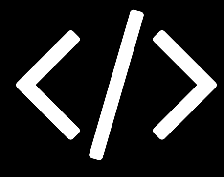

# 1-2 Caracteristicas

StencilJS provee diversas buenas practicas obtenidas de los frameworks mas populares y los mejores features actuales en el desarrollo Front-End, aqui una pequeña lista de caracteristicas que nos ofrece:

- Virtual DOM
- Async rendering (inspired by React Fiber)
- Reactive data-binding
- TypeScript
- JSX

## Custom elements

Los Custom Elements es una capacidad para crear tus propios elementos HTML con sus propios metodos y propiedades

## Shadow DOM

Shadow DOM provee una encapsulacion para el DOM y el CSS

## Plantillas HTML

Nos da la habilitad de crear piezas reusables de HTML que puedan ser usados en tiempo de ejecucion

> para generar webcomponents con estandares

Ahora continua con [1-3 Instalacion](1-3-instalacion.md)
