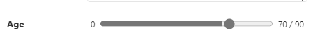
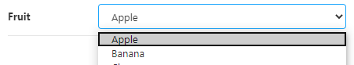
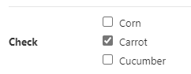
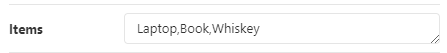
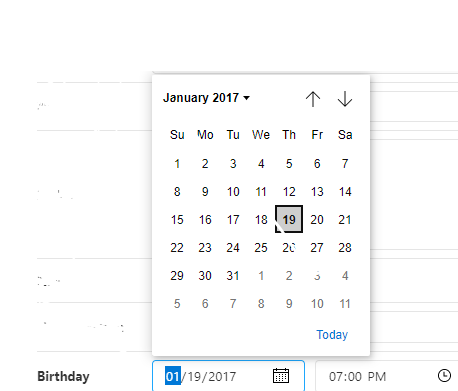

# 2-7 Knobs

## lista de Knobs

- text
- number
- boolean
- color
- select
- radios
- array
- date
- object
- files
- optionsKnob (options)

## Text

Nombre - Valor

```jsx
text("Name", "Storyteller");
```


## number

Nombre - Valor

```jsx
number("Years in NY", 9);
```


## number with delimiter

Nombre - Valor - {min, max, step}

```jsx
number("Dollars", 12.5, { min: 0, max: 100, step: 0.01 });
```


## number with range

Nombre - Valor - {range, min, max, step}

```jsx
number("Age", 70, { range: true, min: 0, max: 90, step: 5 });
```



## boolean

Nombre, Valor

```jsx
boolean("Nice", true);
```


## color

Nombre - Valor

```jsx
color("Background", "rgba(20, 184, 184, 1)");
```

## select

Nombre - Valor - Valor por defecto

```jsx
const fruits = {
  Apple: "apple",
  Banana: "banana",
  Cherry: "cherry",
};
select("Fruit", fruits, "apple");
```



## multi-select

Nombre - Valor - Valor por defecto - Modificador

```jsx
const valuesMultiSelect = {
  Apple: "apple",
  Banana: "banana",
  Cherry: "cherry",
};
options("Multi Select", valuesMultiSelect, ["apple"], {
  display: "multi-select",
});
```


## radios

Nombre - Items - Valor

```jsx
const otherFruits = {
  Kiwi: "kiwi",
  Guava: "guava",
  Watermelon: "watermelon",
};
radios("Other Fruit", otherFruits, "watermelon");
```


## Inline Radio

Nombre - Items - Valor - Modificador

```jsx
const valuesInlineRadio = {
  Saturday: "Saturday",
  Sunday: "Sunday",
};
options("Inline Radio", valuesInlineRadio, "Saturday", {
  display: "inline-radio",
});
```


## Check

Nombre - Items - Valor - Modificador

```jsx
const valuesCheck = {
  Corn: "corn",
  Carrot: "carrot",
  Cucumber: "cucumber",
};
options("Check", valuesCheck, ["carrot"], { display: "check" });
```



## Inline Check

Nombre - Items - Valor - Modificador

```jsx
const valuesInlineCheck = {
  Milk: "milk",
  Cheese: "cheese",
  Butter: "butter",
};
options("Inline Check", valuesInlineCheck, ["milk"], {
  display: "inline-check",
});
```


## array

Nombre - Items - Separador

```jsx
array("Items", ["Laptop", "Book", "Whiskey"], ",");
```



## date

Nombre - Date

```jsx
const defaultBirthday = new Date("Jan 20 2017 GMT+0");
date("Birthday", defaultBirthday);
```



## object

Nombre - Objeto

```jsx
object("Styles", {
  border: "2px dashed silver",
  borderRadius: 10,
  padding: "10px",
});
```


## files

Nombre - Tipo - Valor

```jsx
files("Happy Picture", "image/*", [
  "data:image/png;base64,iVBORw0KGgoAAAANSUhEUgAAABAAAAAQCAQAAAC1+jfqAAAABGdBTUEAALGPC/xhBQAAACBjSFJNAAB6JgAAgIQAAPoAAACA6AAAdTAAAOpgAAA6mAAAF3CculE8AAAAAmJLR0QA/4ePzL8AAAAHdElNRQfiARwMCyEWcOFPAAAAP0lEQVQoz8WQMQoAIAwDL/7/z3GwghSp4KDZyiUpBMCYUgd8rehtH16/l3XewgU2KAzapjXBbNFaPS6lDMlKB6OiDv3iAH1OAAAAJXRFWHRkYXRlOmNyZWF0ZQAyMDE4LTAxLTI4VDEyOjExOjMzLTA3OjAwlAHQBgAAACV0RVh0ZGF0ZTptb2RpZnkAMjAxOC0wMS0yOFQxMjoxMTozMy0wNzowMOVcaLoAAAAASUVORK5CYII=",
]);
```


## Referencias adicionales

[Documentation Knobs](https://github.com/storybookjs/storybook/tree/master/addons/knobs)
[Storybook with Knobs](https://storybooks-official.netlify.app/?path=/story/addons-knobs-withknobs--optionsknob)

Ahora continua con [2-7 Compilacion](2-7-compilacion.md)
