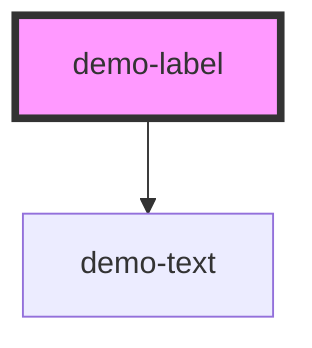

# demo-label

<!-- Auto Generated Below -->

## Properties

| Property   | Attribute  | Description | Type     | Default     |
| ---------- | ---------- | ----------- | -------- | ----------- |
| `lastname` | `lastname` |             | `string` | `undefined` |
| `value`    | `value`    |             | `string` | `undefined` |

## Dependencies

### Depends on

- [demo-text](../demo-text)

### Graph

----------------------------------------------

*Built with [StencilJS](https://stenciljs.com/)*
