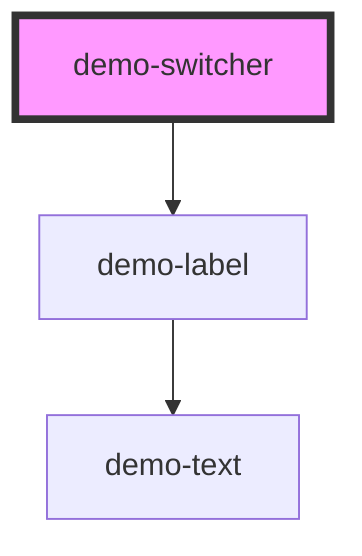

# demo-switcher

<!-- Auto Generated Below -->

## Properties

| Property      | Attribute | Description | Type       | Default             |
| ------------- | --------- | ----------- | ---------- | ------------------- |
| `buttonNames` | --        |             | `string[]` | `["yuri", "putin"]` |
| `label`       | `label`   |             | `string`   | `undefined`         |

## Dependencies

### Depends on

- [demo-label](../demo-label)

### Graph

----------------------------------------------

*Built with [StencilJS](https://stenciljs.com/)*
